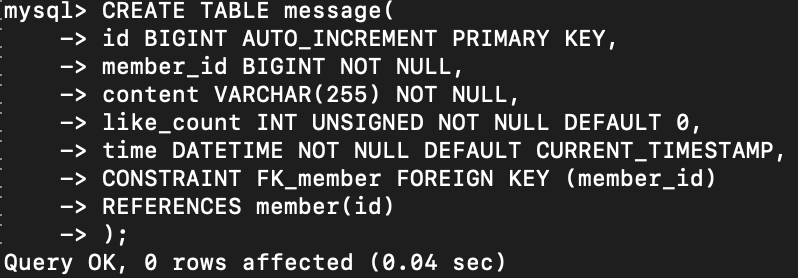

# Week 5 Assignment 

### Task 2 : 
---

####

```
CREATE DATABASE website;
```

- 

####


```
    Create TABLE member(   
        id bigint NOT NULL AUTO_INCREMENT,  
        name varchar(255) NOT NULL,  
        username varchar(255) NOT NULL,  
        password varchar(255) NOT NULL,  
        follower_count int unsigned NOT NULL DEFAULT '0',  
        time datetime NOT NULL DEFAULT CURRENT_TIMESTAMP,) ;
```
- 
  
---
### Task 3: 
---
####

```
    INSERT INTO member(name,username,password)
    VALUES
    ('test','test','test');
```
- 

####

```
    INSERT INTO member(name,username,password)
    VALUES
    ('Holly','H','h1234');
```
- 
####
  
```
    INSERT INTO member(name,username,password)
    VALUES
    ('lily','Lily','lily1234');
    ('steven','S','s1234');
    ('John','JJ','JJ1234');

```
- 

####

```
    SELECT * FROM member;
```
   * 
####


```
    SELECT * FROM member ORDER BY time DESC;
```

- - 
####


```
    SELECT * FROM member ORDER BY time DESC LIMIT 1,3;
```


####

```
    SELECT * FROM member WHERE username='test';
```


####

```
    SELECT * FROM member 
    WHERE name REGEXP 'es';
```

- 
####

```
    SELECT * FROM member 
    WHERE username ='test' AND password = 'test';
```
- 
####


```
    UPDATE member
    SET name = 'test2' 
    WHERE username = 'test';
```

- 
####

---
### Task4
---
####

```
    SELECT COUNT(*)
    FROM member;
```
- 
####

```
    SELECT SUM(follower_count)
    FROM member;
```
- 
####


```
    SELECT AVG(follower_count)
    FROM member;
```

- 
####

```
    SELECT AVG(follower_count)
    FROM(
        SELECT follower_count
        FROM member
        ORDER BY follower_count DESC
        LIMIT 2)
        AS avg_follower;
```

- 
####

---
### Task5
---
####

```
    CREATE TABLE message(
        id BIGINT AUTO_INCREMENT PRIMARY  KEY,
        member_id BIGINT NOT NULL,
        content VARCHAR(255) NOT NULL,
        like_count INT NOT NULL DEFAULT 0.
        time DATETIME NOOT NULL DEFAULT CURRENT_TIMESTAMP.
        CONSTRAINY FK_member FOREGIN KEY ( member_id)
        REFERENCES member(id)
    );
```
- 
- 
####

```
    SELECT message.* member.name
    FROM message 
    LEFT JOIN member
    ON message.member_id = member.id;
```
- 
####

```
    SELECT message.*, member.name
    FROM message
    LEFT JOIN  member
    ON message.member_id = member.id
    WHERE member.username = 'test';
```
- 
####

```
    方法一：

        SELECT AVG(message.like_count)
        FROM (
            SELECT message.X, member.username
            LEFT JOIN member
            ON message.member_id = member.id
            WHERE member.username = 'test')
        AS result;

    方法二：

        SELECT AVG(message.like_count)
        FROM message
        LEFT JOIN member
        ON message.member_id = member.id
        WHERE member.username = 'test';


```
- 方法一
  - 
- 方法二
  - 

####

```
    SELECT member.username, AVG(message.like_count) AS result
    FROM message
    LEFT JOIN member
    ON message.member_id = member.id
    GROUP BY  member.username;
```

- 
